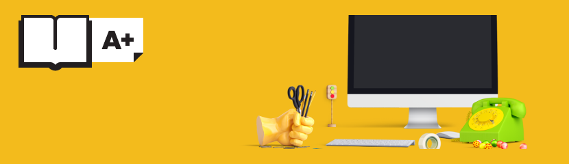

<h1 align="center">Школа А-Плюс</h1>

<h2 align="center">Описание</h2>

Этот проект был создан в процессе прохождения курса на платформе открытое образование от университета ИТМО
"Веб-Программирование" как практика верстки.

<h2 align="center">Технологии</h2>

В этом проекте использовались: 
* HTML
* CSS

<h2 align="center">Дополнительно</h2>

Посмотреть страницу можно [тут](https://github.com/Natalielinen/a-plus-project)

